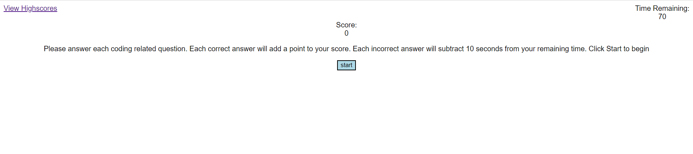
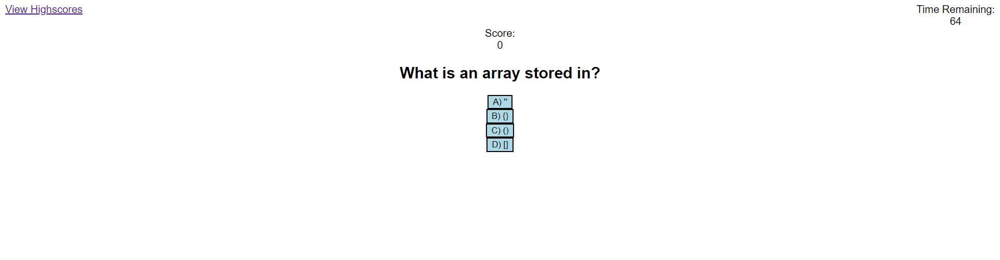
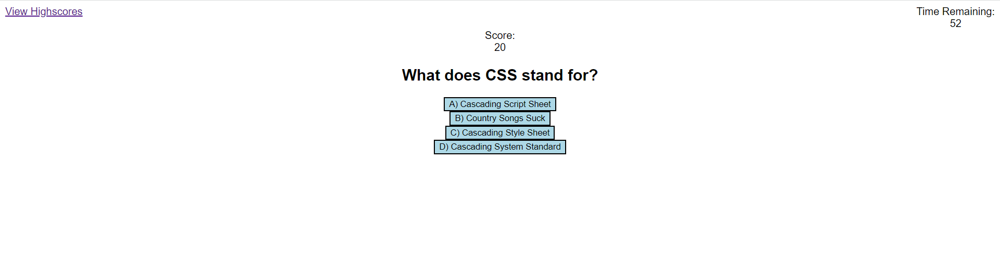
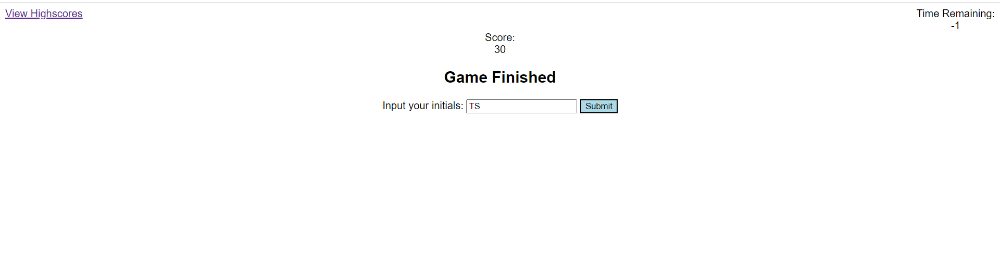

# 04-Challenge-Code-Quiz

# Description
This application is an interactive timed quiz that tests your coding knowledge. Answer all questions within the time limit. Each correct answer adds 10 points, but every incorrect answer removes 5 seconds from the timer. Once the quiz is finished, put in your initials to display your highscores!

# Images

# Links
[Deployed Application](https://tshadday.github.io/04-Challenge-Code-Quiz/)

[GitHub](https://github.com/tshadday/04-Challenge-Code-Quiz)